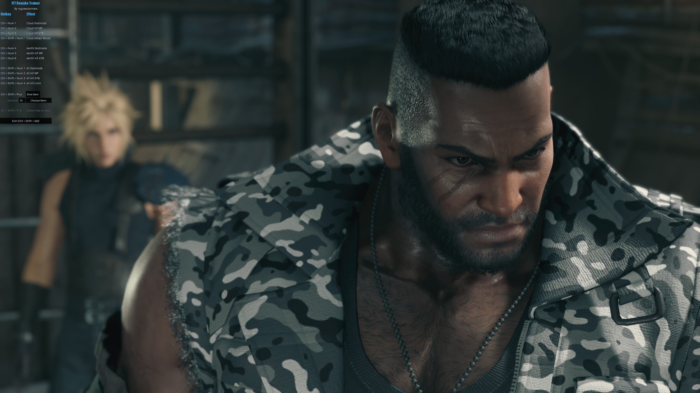

# FF7 Remake Trainer

A cheat trainer for FF7 Remake Intergrade.

# Usage

Create and activate a venv in root dir, install requirements, then run ./app/gui.py.

On Windows:

`python -m venv venv`

`./venv/Scripts/Activate.ps1`

`pip install -r requirements.txt`

`python ./app/gui.py`

# Config

Configure hotkeys/appearance in `settings.py`.

# Screenshots

Default:

Transparent window: (`TRANSPARENT_BG = True`)

Solid window: (`TRANSPARENT_BG = False`)

