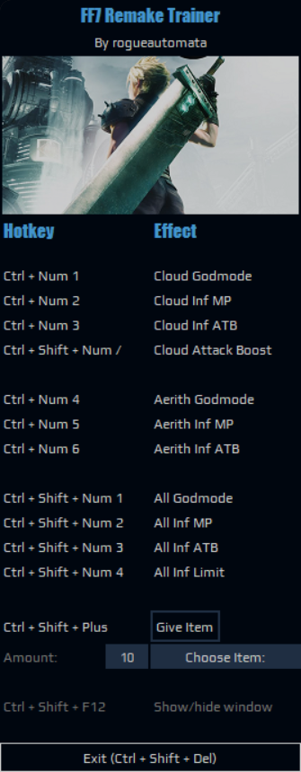
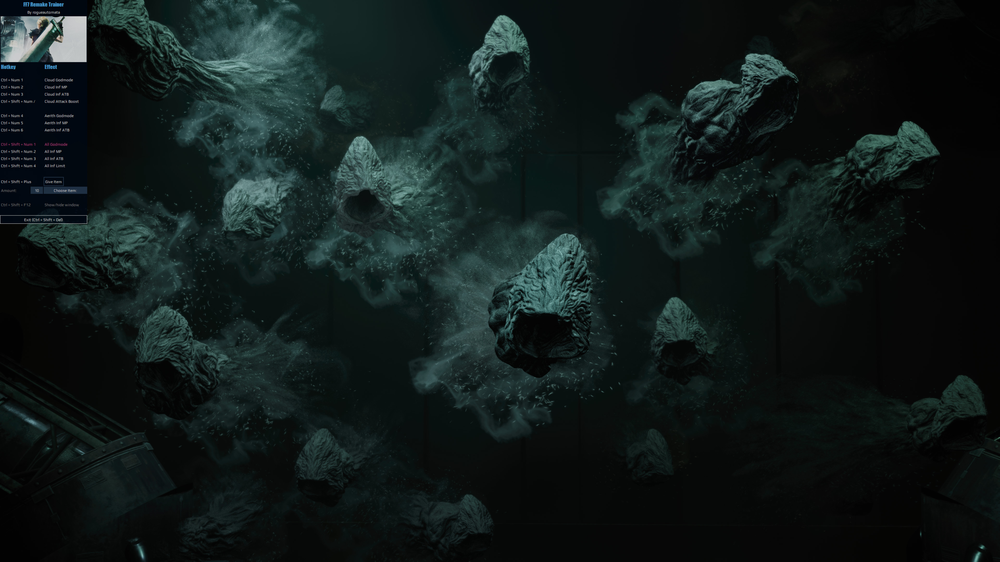

# FF7 Remake Trainer

A cheat trainer for FF7 Remake Intergrade.

```
 ███████████ ███████████ ██████████                                  
░░███░░░░░░█░░███░░░░░░█░███░░░░███                                  
 ░███   █ ░  ░███   █ ░ ░░░    ███                                   
 ░███████    ░███████         ███                                    
 ░███░░░█    ░███░░░█        ███                                     
 ░███  ░     ░███  ░        ███                                      
 █████       █████         ███                                       
░░░░░       ░░░░░         ░░░                                        
 ███████████                                      █████              
░░███░░░░░███                                    ░░███               
 ░███    ░███   ██████  █████████████    ██████   ░███ █████  ██████ 
 ░██████████   ███░░███░░███░░███░░███  ░░░░░███  ░███░░███  ███░░███
 ░███░░░░░███ ░███████  ░███ ░███ ░███   ███████  ░██████░  ░███████ 
 ░███    ░███ ░███░░░   ░███ ░███ ░███  ███░░███  ░███░░███ ░███░░░  
 █████   █████░░██████  █████░███ █████░░████████ ████ █████░░██████ 
░░░░░   ░░░░░  ░░░░░░  ░░░░░ ░░░ ░░░░░  ░░░░░░░░ ░░░░ ░░░░░  ░░░░░░  
 ███████████                      ███                                
░█░░░███░░░█                     ░░░                                 
░   ░███  ░  ████████   ██████   ████  ████████    ██████  ████████  
    ░███    ░░███░░███ ░░░░░███ ░░███ ░░███░░███  ███░░███░░███░░███ 
    ░███     ░███ ░░░   ███████  ░███  ░███ ░███ ░███████  ░███ ░░░  
    ░███     ░███      ███░░███  ░███  ░███ ░███ ░███░░░   ░███      
    █████    █████    ░░████████ █████ ████ █████░░██████  █████     
   ░░░░░    ░░░░░      ░░░░░░░░ ░░░░░ ░░░░ ░░░░░  ░░░░░░  ░░░░░      
                        - by RogueAutomata -
                   - 100% organic LLM-free code -
                       (for better or worse)
```

# Usage

Create and activate a venv in root dir, install requirements, then run ./app/gui.py.

On Windows:

`python -m venv venv`

`./venv/Scripts/Activate.ps1`

`pip install -r requirements.txt`

`python ./app/gui.py` (or `pythonw` if preferred)

I've also included a pyproject.toml so you can install it as a module if preferred:

`pip install .`

`trainer`

# Cheats

For all characters in party:

- Godmode
- Infinite MP
- Infinite ATB
- Infinite Limit
- Attack boost (affects both magic and physical)
- Luck boost
- Give items (choose item from dropdown menu, then press `add item` hotkey)

Most are available individually for Cloud as well.

# Config

Configure hotkeys/appearance in `settings.py`. Appearance options are as follows:

`TRANSPARENT_BG`: If true, then the main trainer window will have an invisible background, so only the text and buttons will be visible. Ideal for overlaying the game window.

`SHOW_IMAGE`: Whether or not to display the image at the top of the trainer.

`HEADER_IMG_PATH`: Relative path of the image to use for above.

`ALPHA`: Alpha transparency of trainer window, including text/buttons. Set between `0.0` (invisible) to `1.0` (solid). Ideal setting is around `0.8`, but this can cause issues with the trainer not being able to render on top of the game window , so I've changed the default to `1.0`.

`FRAMELESS_WINDOW`: Remove the window border and maximize/minimize buttons. Ideal if you want to let the trainer stay topmost. 

Fonts + font size can be changed if desired. You must have the configured fonts installed, else TkDefaultFont value will be used (Segoe UI on Windows).

To edit hotkeys, see notes in `settings.py`.

## About varying game store versions

This was made with the Epic store version of FF7R Intergrade. A config option is available for Steam version as well, though I have not tested it, so it may or may not work for you. (set `GAME_VERSION` to `steam` in `settings.py`) This option will change the base addresses used when reading pointers; I've done what I can to try to make it compatible + configurable without having a copy of Steam version to test on, but no guarantees here.

# Build

Activate venv, then run `./build_all.bat`. It will automate building with Cython, package with pyinstaller and leave an exe in `/dist`.

# Screenshots

Default:



Transparent window: (`TRANSPARENT_BG = True`)


Solid window: (`TRANSPARENT_BG = False`)


