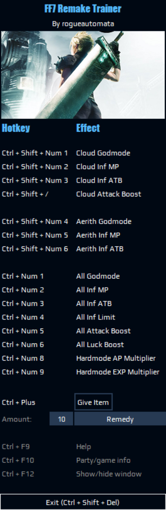

# FF7 Remake Trainer

A cheat trainer for FF7 Remake Intergrade.

# Usage

Create and activate a venv in root dir, install requirements, then run ./app/gui.py.

On Windows:

`python -m venv venv`

`./venv/Scripts/Activate.ps1`

`pip install -r requirements.txt`

`python ./app/gui.py` (or `pythonw` if preferred)

# Config

Configure hotkeys/appearance in `settings.py`.

# Build

On Windows, from project root dir:

1. Configure settings if desired (mainly `TRANSPARENT_BG` and `SHOW_IMAGE`, if you want to change them);
2. Activate venv `./venv/Scripts/Activate.ps1`;
3. Execute `build.bat`.

Or, build with Cython before packaging with pyinstaller:

1. Configure settings;
2. Activate venv `./venv/Scripts/Activate.ps1`;
3. Copy or rename `app/gui.py` to `app/gui.pyx`;
3. `python setup.py build_ext --inplace`, then move the generated gui.pyd to `./app` dir;
4. `build_cy.bat`

Either way, the final .exe will be in `/dist`.

# Screenshots

Default:

Transparent window: (`TRANSPARENT_BG = True`)

Solid window: (`TRANSPARENT_BG = False`)

